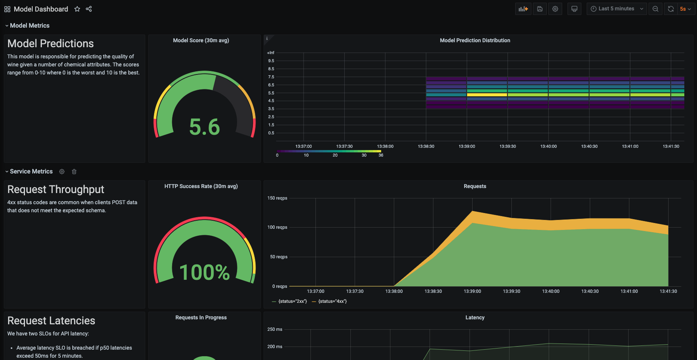

# ml-monitoring
*Jeremy Jordan*

This repository provides an example setup for monitoring an ML system deployed on Kubernetes.

Blog post: https://www.jeremyjordan.me/ml-monitoring/

Components:
- ML model served via `FastAPI`
- Export server metrics via `prometheus-fastapi-instrumentator`
- Simulate production traffic via `locust`
- Monitor and store metrics via `Prometheus`
- Visualize metrics via `Grafana`



## Setup

1. Ensure you can connect to a Kubernetes cluster and have [`kubectl`](https://kubernetes.io/docs/tasks/tools/install-kubectl/) and [`helm`](https://helm.sh/docs/intro/install/) installed.
    - You can easily spin up a Kubernetes cluster on your local machine using [minikube](https://minikube.sigs.k8s.io/docs/start/).
```
minikube start --driver=docker --memory 4g --nodes 2
```

2. Deploy Prometheus and Grafana onto the cluster using the [community Helm chart](https://github.com/prometheus-community/helm-charts/tree/main/charts/kube-prometheus-stack).
```
kubectl create namespace monitoring
helm install prometheus-stack prometheus-community/kube-prometheus-stack -n monitoring
```
3. Verify the resources were deployed successfully.
```
kubectl get all -n monitoring
```
4. Connect to the Grafana dashboard.
```
kubectl port-forward svc/prometheus-stack-grafana 8000:80 -n monitoring
```
- Go to http://127.0.0.1:8000/
- Log in with the credentials:
    - Username: admin
    - Password: prom-operator
    - (This password can be configured in the Helm chart `values.yaml` file)
5. Import the model dashboard.
    - On the left sidebar, click the "+" and select "Import".
    - Copy and paste the JSON defined in `dashboards/model.json` in the text area.

## Deploy a model

This repository includes an example REST service which exposes an ML model trained on the [UCI Wine Quality dataset](https://archive.ics.uci.edu/ml/datasets/wine+quality). 

You can launch the service on Kubernetes by running:

```
kubectl apply -f kubernetes/models/
```

You can also build and run the Docker container locally.

```
docker build -t wine-quality-model -f model/Dockerfile .
docker run -d -p 3000:80 -e ENABLE_METRICS=true wine-quality-model
```

> **Note:** In order for Prometheus to scrape metrics from this service, we need to define a `ServiceMonitor` resource. This resource must have the label `release: prometheus-stack` in order to be discovered. This is configured in the `Prometheus` resource spec via the `serviceMonitorSelector` attribute. 

You can verify the label required by running:
```
kubectl get prometheuses.monitoring.coreos.com prometheus-stack-kube-prom-prometheus -n monitoring -o yaml
```

## Simulate production traffic

We can simulate production traffic using a Python load testing tool called [`locust`](https://locust.io/). This will make HTTP requests to our model server and provide us with data to view in the monitoring dashboard.

You can begin the load test by running:
```
kubectl apply -f kubernetes/load_tests/
```
By default, production traffic will be simulated for a duration of 5 minutes. This can be changed by updating the image arguments in the `kubernetes/load_tests/locust_master.yaml` manifest.

You can also modify the community [Helm chart](https://github.com/deliveryhero/helm-charts/tree/master/stable/locust/templates) instead of using the manifests defined in this repo.


## Uploading new images

This process can eventually be automated with a Github action, but remains manual for now.

1. Obtain a personal access token to connect with the Github container registry.
```
echo "INSERT_TOKEN_HERE" >> ~/.github/cr_token
```
2. Authenticate with the Github container registry.
```
cat ~/.github/cr_token | docker login ghcr.io -u jeremyjordan --password-stdin
```
3. Build and tag new Docker images.
```
docker build -t wine-quality-model:0.3 -f model/Dockerfile .
docker tag wine-quality-model:0.3 ghcr.io/jeremyjordan/wine-quality-model:0.3
```

```
docker build -t locust-load-test:0.2 -f load_test/Dockerfile .
docker tag locust-load-test:0.2 ghcr.io/jeremyjordan/locust-load-test:0.2
```
4. Push Docker images to container registery.
```
docker push ghcr.io/jeremyjordan/wine-quality-model:0.3
docker push ghcr.io/jeremyjordan/locust-load-test:0.2
```
5. Update Kubernetes manifests to use the new image tag.

## Teardown instructions

To stop the model REST server, run:
```
kubectl delete -f kubernetes/models/
```

To stop the load tests, run:
```
kubectl delete -f kubernetes/load_tests/
```

To remove the Prometheus stack, run:
```
helm uninstall prometheus-stack -n monitoring
```
